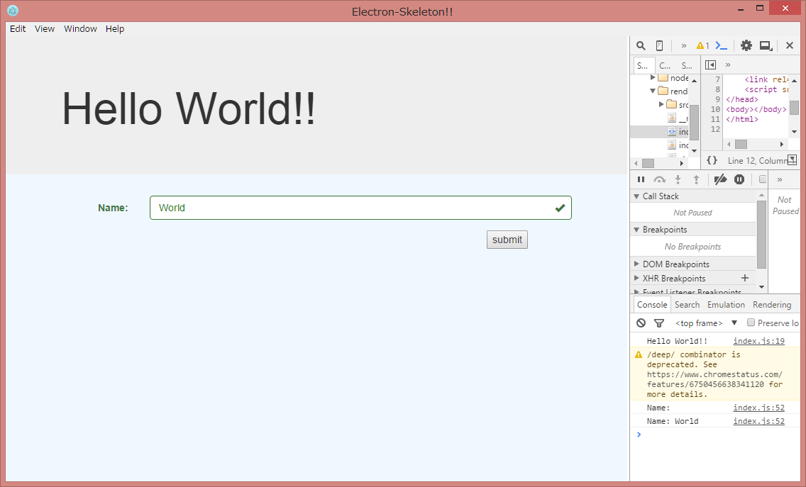

# electron-skeleton
skeleton for electron



###usage
```
$ npm install
$ cd ./app
$ npm install
$ cd ../
$ npm start
```

###package
```
$ gulp
```

###lib etc...
- [Electron](http://electron.atom.io/)
- [electron-compile](https://github.com/electronjs/electron-compile)
- [electron-edge](https://github.com/kexplo/electron-edge)
- [RxJS](http://reactivex.io/)
- [Cycle.js](http://cycle.js.org/)
- [jQuery](https://jquery.com/)
- [Bootstrap](http://getbootstrap.com/)
